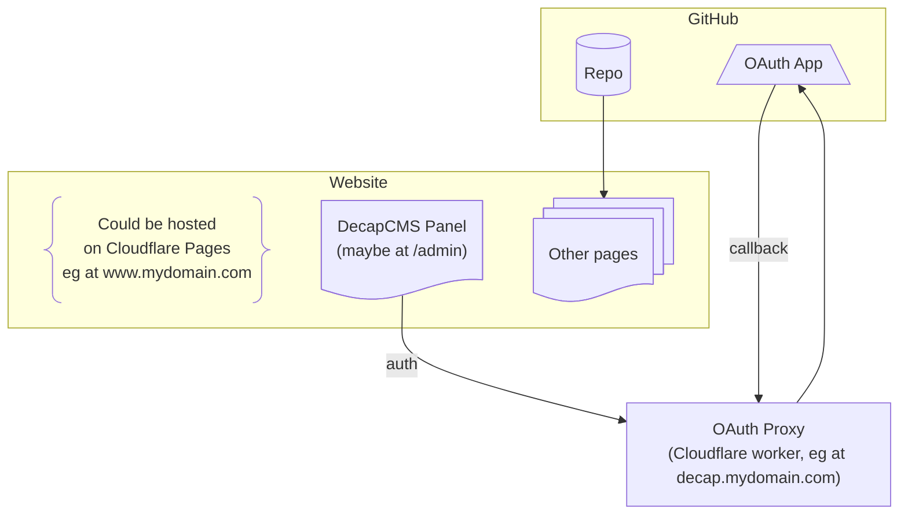

# decap-proxy

A Cloudflare Worker Github OAuth proxy for [Decap CMS](https://github.com/decaporg/decap-cms). This allows for deploying Decap without the Netlify Identity or Git Gateway services required to handle Github authentication so that the CMS client can make Github API calls.

## Overview

Suppose you have a website that is generated from some source files on GitHub and you want to provide an admin page where people who lack an understanding of git or HTML can edit the source files using a friendly browser-based interface. Decap CMS provides such an interface and can be configured to work with Github as the back-end, using Cloudflare to serve an [OAuth Proxy](https://decapcms.org/docs/backends-overview/#using-github-with-an-oauth-proxy) that will act as an authentication go-between.

This repository provides the elements needed to deploy such an OAuth Proxy on a Cloudflare Worker node. The proxy will be deployed to its own subdomain, separate from whatever website domain you're using Decap to manage. That subdomain will be referenced by the **PROXY URL**, below, and used exclusively for hosting the OAuth Proxy. Either you will be using the `workers.dev` domain that Cloudflare automatically gives your workers, or you will be providing a custom subdomain (eg. `proxy.mydomain.com`) for a domain zone you own.



Decap CMS  assumes that you have some sort of CI/CD pipeline set up so that when commits are made to your github source, your website will be rebuilt, automatically. If you want to use a Cloudflare-based solution for that side of things, you could consider using Cloudflare Pages, or even Cloudflare Workers. Any such setups are not covered by this document, but it's recommended that you have that working before proceeding.

The basic steps for setting up the rest of the setup described above are:

1. [Create a GitHub OAuth App](#1-create-a-github-oauth-app)
2. [Deploy the OAuth Proxy](#2-deploy-the-oauth-proxy)
3. [Configure Decap CMS to use the OAuth Proxy](#3-configure-decap-cms-to-use-the-oauth-proxy)

But first, to reduce ambiguity during setup, it makes sense to establish some working parameters.

| Parameter        | Description           | Example Value |
| ---------------- | ------------- | --------- |
| **PROXY ZONE**  | the custom zone, if you are using one, that forms part of the URL for your OAuth proxy | `mydomain.com` |
| **PROXY DOMAIN**  | the subdomain of your custom zone, if you are using one, where your OAuth proxy will be found | `decap.mydomain.com` |
| **PROXY URL**    | the URL that will be hosting decap-proxy. If you aren't using a custom domain for your OAuth Proxy, it will be the `https://<worker-name>.<account-name>.workers.dev` URL that Cloudflare gives you.       | `https://decap.mydomain.com` |


## 1. Create a Github OAuth App

Once you're logged into the GitHub account that hosts the source to your web-page, you can [configure a Github OAuth application](https://github.com/settings/applications/new). 

* For `Homepage URL`, please enter the **PROXY URL**.
* For `Application callback URL`, please enter the **PROXY URL** followed by `/callback`. For the example in the table above, it would mean using: `https://decap.mydomain.com/callback`.
* The `Application Name` and `Application Description` can be whatever you want them to be. They will not affect the functionality of the GitHub OAuth App.

Save the OAuth client ID and secret - you'll need them in [2.4 Configure the Cloudflare Worker](#24-configure-the-cloudflare-worker), below.

In the future, when you want to revisit the OAuth App you have created here, you can find it under `OAuth Apps` on the github [Developer Settings page](https://github.com/settings/developers).

## 2. Deploy the OAuth Proxy

You will need some sort of working area where you will be cloning this decap-proxy repo, editing its contents, and performing the deployment of the OAuth Proxy. This working area typically consists of a terminal on your local computer where you can run node packages using `npx` and you have a browser available (though the latter is optional).

Here's an overview of the steps needed to deploy the OAuth Proxy. 

1. [Clone decap-proxy](#21-clone-decap-proxy)
2. [Prepare the wrangler.toml file](#22-prepare-the-wranglertoml-file)
3. [Establish Connection to Cloudflare](#23-establish-connection-to-cloudflare)
4. [Configure the Cloudflare Worker](#24-configure-the-cloudflare-worker)
5. [Deploy the Proxy on the Worker](#25-deploy-the-proxy-on-the-worker)

Details follow.

### 2.1 Clone decap-proxy

Use whatever git tools you would normally use to clone this repository to your working area. Most people would be able to use the following command in their terminal: `git clone https://github.com/sterlingwes/decap-proxy`.

### 2.2 Prepare the wrangler.toml file

The first step is to copy wrangler.toml.sample to wrangler.toml. For many people, this would mean running the following command in their terminal: `cp wrangler.toml.sample wrangler.toml`. You can look at the commented-out directives in the resulting file and see if there are any unusual configuration of Cloudflare you wish to enact. But for most people, especially when getting started, you only need to consider the following four changes.

The *name* parameter at the top defines the name that your worker will be given in your Cloudflare dashboard, and will determine the first part of the default URL for the worker, if you don't disable that. You should change the name to something sensible for you.

If you're using a custom domain in your **PROXY URL**, then alter wrangler.toml by uncommenting and appropriately altering the route directive at the top of the file to use **PROXY DOMAIN** as the `pattern`, and **PROXY ZONE** as the `zone_name`:

```typescript
route = { pattern = "decap.mydomain.com", zone_name = "mydomain.com", custom_domain = true }
```
Make sure you change the `pattern` and `zone_name` to be consistent with your **PROXY URL**.

Even with that change, the OAuth proxy will be available at the default workers.dev domains that are available for workers. You can disable that by uncommenting this line at the top of wrangler.toml:

```typescript
workers_dev = false
```

Finally, if the github repository that holds the source to your website is a private repository, then you should change the declaration of the `GITHUB_REPO_PRIVATE` in wrangler.toml to set the value to 1.

### 2.3 Establish Connection to Cloudflare

In order to deploy the OAuth proxy using the files in your decap-proxy clone, you will need to establish an authenticated connection to Cloudflare in your terminal. For most situations, you can simply run `npx wrangler login` in your terminal and it will launch a browser that will prompt you for the credentials needed for the connection.

But if that is not possible (eg if your working environment is a remote terminal or a container that has no browser), you can also set up the connection using environment variables like so (for bash-type shells):

```bash
export CLOUDFLARE_ACCOUNT_ID=...
export CLOUDFLARE_API_TOKEN=...
```

You can find your Cloudflare Account ID by logging into cloudflare and going to your account home, and looking at the resulting URL. The long string of hexadecimal characters in the URL is your account ID.

The API TOKEN is the secret that CloudFlare provides you when you create an API Token. The one you use for decap-proxy should have been created with the "Edit Cloudflare Workers" template.

#### 2.4 Configure the Cloudflare worker

Using the OAuth application credentials you saved from the first section, you'll enter these as `GITHUB_OAUTH_ID` and `GITHUB_OAUTH_SECRET` secret values for your worker in the Cloudflare admin (nested under: `Compute (Workers) > Workers & Pages` > `Your Worker (decap-proxy)` > `Settings` > `Variables and Secrets` > `+ Add` and change the type to **Secret**).

Alternatively, you can also add secrets via Wrangler:

```bash
npx wrangler secret put GITHUB_OAUTH_ID
npx wrangler secret put GITHUB_OAUTH_SECRET
```

#### 2.5 Deploy the Proxy on the Worker

Now that everything has been set up in that terminal, it's just a matter of deploying all that information to Cloudflare. This is simply done by running:
```
npx wrangler deploy
```
Once deployed, you can test that the deployment has worked, by pointing your browser at your **PROXY URL**. If you see a page that says "Hello 👋", then it is deployed to the right location. This doesn't mean it is configured correctly, but at least it is being served in the right place.

### 3 Configure Decap CMS to use the OAuth Proxy

Configure the backend section of Decap's `config.yml` to tell it where to find your website source on github, to set base_url to your **PROXY URL**, and to specify that `/auth` is the authentication endpoint being served by your OAuth Proxy. Your config.yml should look something like this:

```yaml
# ...
# other config omitted
backend:
  name: github
  branch: main
  repo: "github-user/repo-name"           # <-- This should identify the repo for your website
  base_url: https://decap.mydomain.com    # <-- This should contain your PROXY URL
  auth_endpoint: /auth
# ...
```

Once that configuration has been pushed out to your website, you can test the live Decap CMS panel, and hopefully everything will work as planned.

If you do manage to authenticate using the GitHub OAuth App, but DecapCMS gives you an error about the repository not being found, make sure you have configured the repository name and owner correctly in your config.yml file. Also if your repo is private, make sure you configured the `GITHUB_REPO_PRIVATE` variable correctly in step 2.2.

